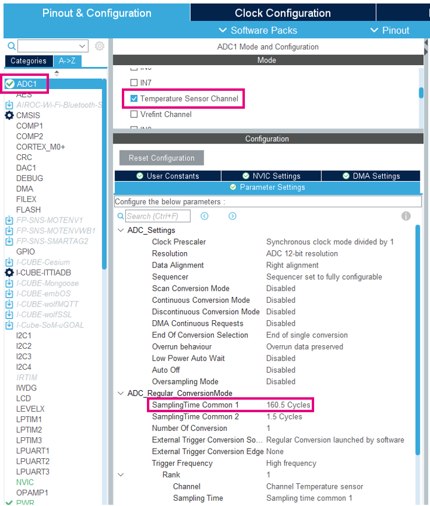
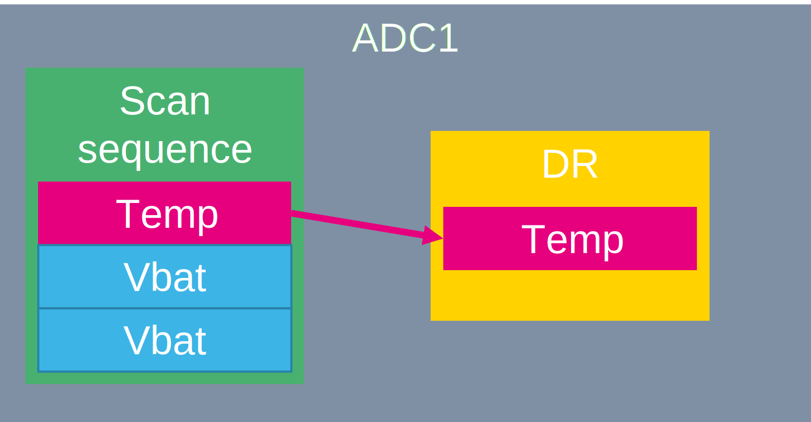
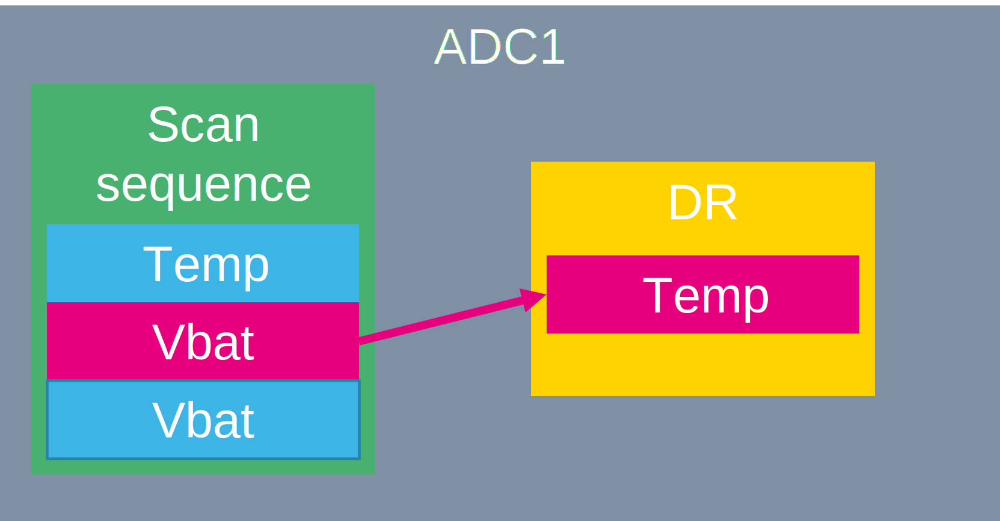
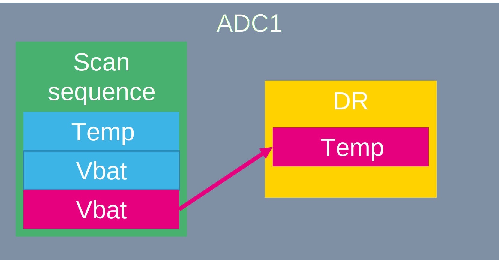
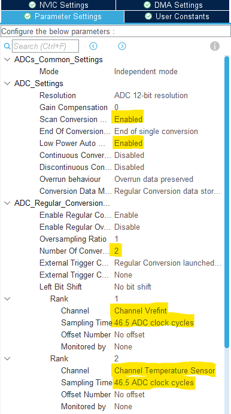
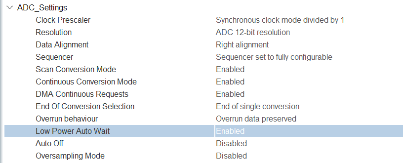
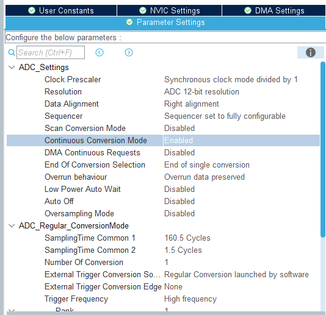
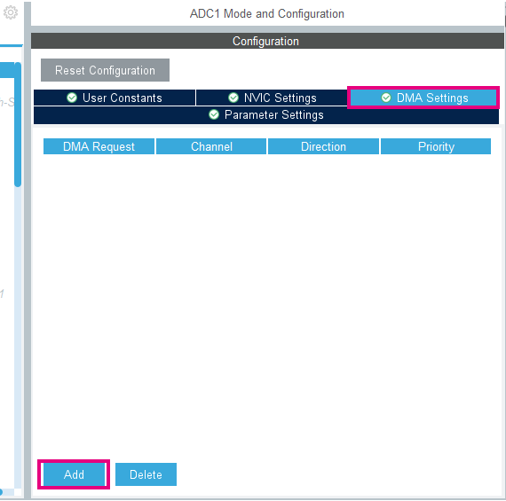
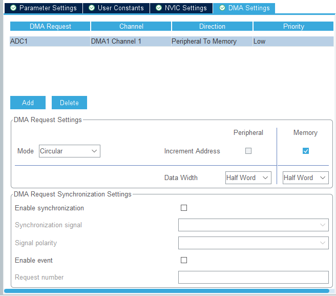
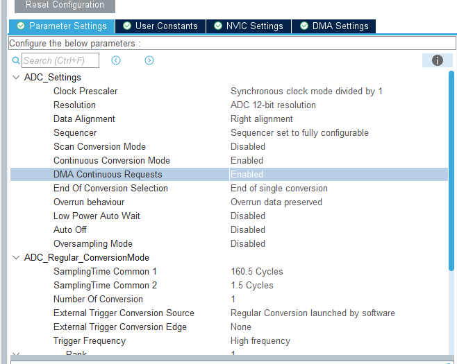

# CubeMX Configuration

1. Select ADC1
2. Select temperature sensor

In Configuration

3. Set `Sampling Time Common 1` to **160.5 cycles**



4. Generate code

# CubeIDE - Measure ADC value

1. Add variable for ADC data in *USER CODE PV* section. We will read the value from ADC and stock it in this variable.

```c
volatile uint16_t value;
```

2. Calibrate ADC, start ADC and read data

Write the following code in the *USER CODE WHILE* section:

```c
  HAL_ADCEx_Calibration_Start(&hadc1);
  HAL_ADC_Start(&hadc1);
  HAL_ADC_PollForConversion(&hadc1, 0xFFFFFFFF);
  value = HAL_ADC_GetValue(&hadc1);
```

3. Compile and debug the code
4. Add value to `Live variables`
5. Try to head the device

# CubeIDE - Convert ADC data to real temperature

1. Add temperature variable to *USER CODE PV* section:

```c
volatile int32_t temperature;
```

2. Add a conversion after ADC reading in the *USER CODE WHILE* section:

```c
  temperature =__HAL_ADC_CALC_TEMPERATURE(3300, value, ADC_RESOLUTION_12B);
```

3. Now we can add the `temperature` variable to live watch


-----------------------


#  Scan ADC

We will create a sequence to convert three channels:




We will add a new channel to our regular sequence.

#  CubeMX

1. Enable `Vrefint channel `and `Vbat channel`
2. Set `Number of Conversion` to **3**

This will enable the scan mode. Now our sequence have 3 items

3. Set Rank 2 `Channel` to **Vbat channel**
4. Set `Sampling time` to **Sampling Time Common 1**
5. Set Rank 3 `Channel` to **Vrefint channel**
6. Set `Sampling time` to **Sampling Time Common 1**



To prevent of data overrun we enable `Low Power Auto Wait`.

7. set `Low Power Auto Wait` to **ENABLE**



8. Generate code

#  CubeIDE

1. **Add** variables for vbat and vrefint in *USER CODE PV* section:

```c
volatile uint16_t vbat;
volatile uint16_t vrefint;
```

2. To read the ADC for new values, **add** the following code in the *USER CODE WHILE* section:

```c
  HAL_ADC_PollForConversion(&hadc1, 0xFFFFFFFF);
  vbat= HAL_ADC_GetValue(&hadc1);
  HAL_ADC_PollForConversion(&hadc1, 0xFFFFFFFF);
  vrefint= HAL_ADC_GetValue(&hadc1);
```

3. Start debug.
4. Check results in live watch.
5. You can try to disable Low power Auto wait. And check the results.


-------------------


# CubeMX Configuration

Now we will use DMA to read data from ADC. So the core will not need to handle it.

1. In ADC1 config, set `continuous conversion mode` to **ENABLE**.



2. Open DMA settings Click on `ADD` and select ADC1.



The minimum settings as the legacy STM32 will be

- Circular mode
- Request
- Priority
- Direction
- Source address increment after transfer
- Source Data width
- Destination address increment after transfer
- Destination Data width

Configure the DMA as shown just bellow:



3. Go back in *Parameter Settings* and set `DMA Continuous Requests` to **ENABLE**.



4. Generate code.

# CubeIDE

1. Add ADC buffer for DMA in *USER CODE PV* section:

```c
/* USER CODE BEGIN PV */
uint16_t adc_buffer[3];
/* USER CODE END PV */
```

2. Start the DMA and ADC

```c
  /* USER CODE BEGIN 2 */
  HAL_ADCEx_Calibration_Start(&hadc1);
  HAL_ADC_Start_DMA(&hadc1, adc_buffer, 3);
  /* USER CODE END 2 */
```

3. **Remove** poll reading from while loop and **add** the following code in the *USER CODE WHILE* section:

```c
    temperature =__HAL_ADC_CALC_TEMPERATURE(3300, adc_buffer[0], ADC_RESOLUTION_12B);
	  vrefint = adc_buffer[1];
	  vbat = adc_buffer[2];
```
