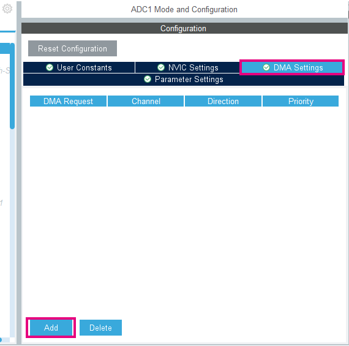

----!
Presentation
----!
# CubeMX Configuration

Now we will use DMA to read data from ADC. So the core will not need to handle it.

1. In ADC1 config, set `continuous conversion mode` to **ENABLE**


2. Open DMA settings Click on `ADD` and select ADC1.



The minimum settings as the legacy STM32 will be

- Circular mode
- Request
- Priority
- Direction
- Source address increment after transfer
- Source Data width
- Destination address increment after transfer
- Destination Data width

Configure the DMA as shown just bellow:


3. Go back in *Parameter Settings* and set `DMA Continuous Requests` to **ENABLE**


4. Generate code

# CubeIDE

1. Add ADC buffer for DMA in *USER CODE PV* section:

```c
/* USER CODE BEGIN PV */
uint16_t adc_buffer[3];
/* USER CODE END PV */
```

2. Start the DMA and ADC

```c
  /* USER CODE BEGIN 2 */
  HAL_ADCEx_Calibration_Start(&hadc1);
  HAL_ADC_Start_DMA(&hadc1, adc_buffer, 3);
  /* USER CODE END 2 */
```

3. **Remove** poll reading from while loop and **add** the following code in the *USER CODE WHILE* section:

```c
    temperature =__HAL_ADC_CALC_TEMPERATURE(3300, adc_buffer[0], ADC_RESOLUTION_12B);
	  vrefint = adc_buffer[1];
	  vbat = adc_buffer[2];
```
