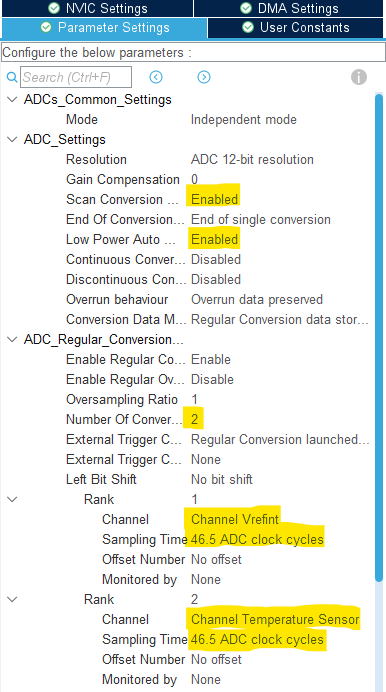

----!
Presentation
----!
#  Scan ADC

We will create a sequence to convert two channels:

<p> </p>

We will add a new channel to our regular sequence.

#  CubeMX

1. Enable `Vrefint channel `and `VSENSE channel` linked to temperature sensor
2. Set `Number of Conversion` to **2**

This will enable the scan mode. Now our sequence have 3 items

3. Set Rank 1 `Channel` to **Vrefint channel*
4. Set `Sampling time` to **46.5 ADC clock cycle**
5. Set Rank 2 `Channel` to **Temperature sensor channel**
6. Set `Sampling time` to **46.5 ADC clock cycle**

To prevent of data overrun we enable `Low Power Auto Wait`.

7. set `Low Power Auto Wait` to **ENABLE**


   
8.  ADC kernel clock can be reduced to **24 MHZ**
   
 
   
9.  Generate code

#  CubeIDE

1. **Add** variables for vbat and vrefint in *USER CODE PV* section:
     

```c
volatile uint16_t adcVref = 0;
volatile uint16_t adcTemp = 0;

volatile uint16_t Vref = 0;
volatile int16_t Temp = 0;
```

2. Start ADC calibration in *USER CODE BEGIN 2* section

```c
/* Run ADC calibration*/
  if(HAL_ADCEx_Calibration_Start(&hadc1, ADC_SINGLE_ENDED) != HAL_OK)
  {
        Error_Handler();
  }
```

3. To read the ADC for new values, **add** the following code in the *USER CODE WHILE* section:
   with help of macros to convert actual VDDA/Vref+ and temperature thanks to stored values from production


```c
HAL_ADC_Start(&hadc1);
HAL_ADC_PollForConversion(&hadc1, 1);
adcVref = HAL_ADC_GetValue(&hadc1);

/*Helper macro to calculate analog reference voltage (Vref+) unit: mVolt */
Vref = __LL_ADC_CALC_VREFANALOG_VOLTAGE(adcVref,LL_ADC_RESOLUTION_12B);

HAL_ADC_PollForConversion(&hadc1, 1);
adcTemp = HAL_ADC_GetValue(&hadc1);

/*Helper macro to calculate Temperature, unit: degree Celsius */
Temp = __LL_ADC_CALC_TEMPERATURE(Vref, adcTemp, LL_ADC_RESOLUTION_12B);
```

4. Possible further reduction to put ADC in **DEEP POWER MODE** - no effect under Stop 3 and calibration data are lost.
  
```c
HAL_ADCEx_EnterADCDeepPowerDownMode(&hadc1);
```
  

1. Start debug.
2. Check results in live watch.
3. You can try to disable Low power Auto wait. And check the results.
