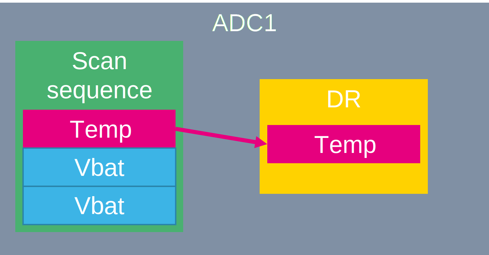
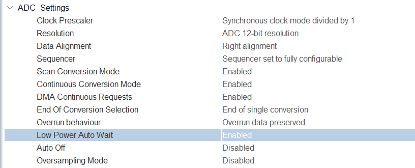

----!
Presentation
----!
#  Scan ADC

We will create a sequence to convert three channels:



We will add a new channel to our regular sequence.

#  CubeMX

1. Enable `Vrefint channel `and `Vbat channel`
2. Set `Number of Conversion` to **3**

This will enable the scan mode. Now our sequence have 3 items

3. Set Rank 2 `Channel` to **Vbat channel**
4. Set `Sampling time` to **Sampling Time Common 1**
5. Set Rank 3 `Channel` to **Vrefint channel**
6. Set `Sampling time` to **Sampling Time Common 1**


To prevent of data overrun we enable `Low Power Auto Wait`.

7. set `Low Power Auto Wait` to **ENABLE**



8. Generate code

#  CubeIDE

1. **Add** variables for vbat and vrefint in *USER CODE PV* section:

```c
volatile uint16_t vbat;
volatile uint16_t vrefint;
```

2. To read the ADC for new values, **add** the following code in the *USER CODE WHILE* section:

```c
  HAL_ADC_PollForConversion(&hadc1, 0xFFFFFFFF);
  vbat= HAL_ADC_GetValue(&hadc1);
  HAL_ADC_PollForConversion(&hadc1, 0xFFFFFFFF);
  vrefint= HAL_ADC_GetValue(&hadc1);
```

3. Start debug.
4. Check results in live watch.
5. You can try to disable Low power Auto wait. And check the results.
