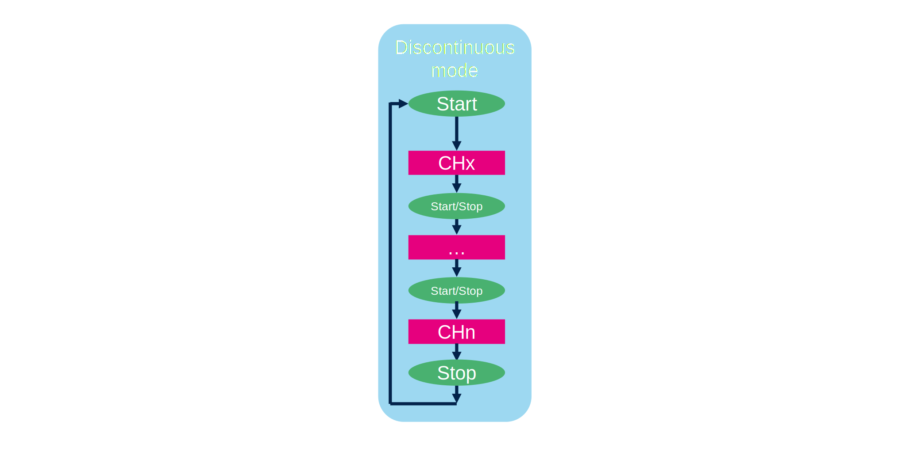
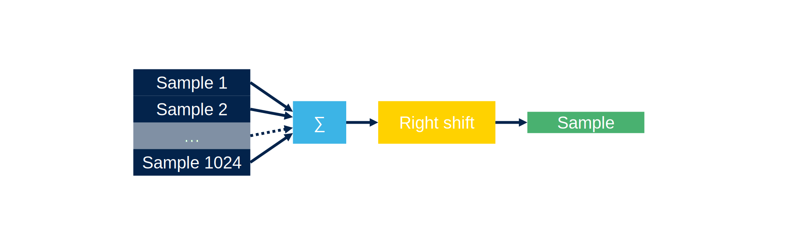
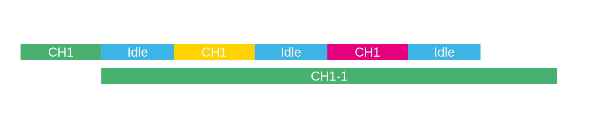
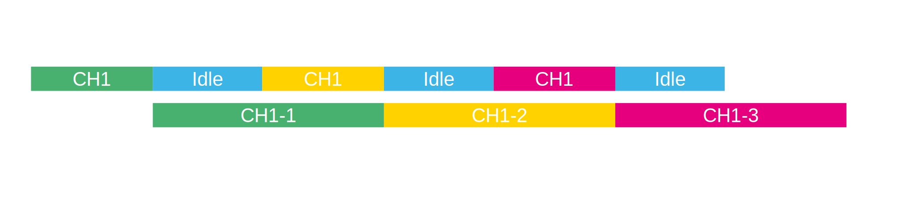

----!
Presentation
----!

# ADC features

Features of STM32U0 ADC

- Programmable resolution up to 12bit
- Max sampling speed 2.5Msps
- HW offset calibration
- Oversampling
- Data register 16bit
- DMA support
- Analog watchdogs
- 16 External channels
- Temperature sensor & Voltage reference calibration values

# ADC inputs

Channels connection can be found in **[Reference Manual](https://www.st.com/resource/en/user_manual/um3261-stm32u0-series-safety-manual-stmicroelectronics.pdf)**.

## ADC input channel

### Single ended input channel

Adc will convert voltage where the low level is Vref-.

## Channel types

### **External inputs**

This inputs are directly connect to GPIO pins of the STM32U0.
The pin mode must be set to `Analog`.

### **Internal inputs**

The ADC input is connected to internal peripheries of STM32U0.
Typically some internal referential voltages can be read or temperature sensor.

# ADC resolution

The ADC can be set to different resolution.

## ADC1

Resolution up to 12bit.
It is possible to perform faster conversion by reducing the ADC resolution.

| Resolution | Conversion periods (ADC Clock cycles) |
|------------|--------------------|
| 12 bit     | 12.5 ADC CLK       |
| 10 bit     | 10.5 ADC CLK       |
| 8 bit      | 18.5 ADC CLK       |
| 6 bit      | 6.5 ADC CLK        |

# ADC (regular) conversion modes

In this part we will focus on two options:

- CONT mode (continuous)
- DISCEN mode (discontinuous)

## Single conversion

Setup:

- CONT = 0
- DISC = 0

Only one conversion is performed then ADC is stopped.

## Single continuous conversion

Setup:

- CONT = 1
- DISC = 0

the same channel is continuously samples, ADC newer stops.

## Discontinuous Conversion Mode

Setup:

- CONT = 0
- DISC = 1

A mode when scan stop after set number of conversion in sequence and wait for new start/trigger.

# Oversampling

The oversampling unit performs data preprocessing to offload the CPU. It can handle multiple conversions and average them into a single data with increased data width, up to 16-bit.

The oversample will collect from 2x to 256x samples and add them together. Then a right shift is managed.

This can increase a resolution of ADC but it will increase the time needed for one final sample.

# ADC overrun

On the ADC may occur an overrun condition. It mean that the converted data was not read in time by the CPU or the DMA, before the data from a new conversion is available.

That ADC converted new value but the previous was not read.
This can easily happen in scan mode without DMA.

The for this we can set two behaviors.

- Overrun data preserved
- Overrun data overwritten

## Overrun data preserved

The old data are kept in ADC registers.

The new data are lost.

## Overrun data overwritten

The old data are lost.

New data are preserved.

# ADC conversion management data mode

This option will set how the ADC results will be handled.
there are three options:

- Regular Conversion data stored in DR register only
- DMA one shot mode
- DMA circular mode

## Regular Conversion data stored in DR register only

The data from ADC conversion store in ADC DR.

## DMA one shot mode

The ADC will generate a DMA requests during first scan sequence.
If ADC is in continuous mode the rest of the scan sequence will not generate DMA requests.

## DMA circular mode

The ADC will generate DMA requests for every regular conversion.

# Low power features
## Auto wait

ADC can automatically wait until last data is read.
This solve issue with overruns. This is a way to automatically adapt the speed of the ADC to the speed of the system that
reads the data.

## Auto-OFF mode

The ADC has an automatic power management feature which is called auto-off mode.

When activated, the ADC is always powered off when not converting and automatically wakes-up when a conversion is started (by software or hardware trigger).

Auto-off mode can cause a dramatic reduction in the power consumption of applications which need relatively few conversions or when conversion requests are timed far enough apart.
