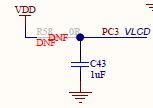

----!
Presentation
----!

# CubeIDE
- Open **CubeIDE** and related `lcd` project


# Correct minor bugs in Generated Project

## Reorder peripheral's initialization
LCD requires its kernel clock (LSE in our case) but CubeMX script initializes LCD first and then RTC which lead to LCD configuration issue. 

Copy & paste `MX_RTC_Init()` before `MX_LCD_Init()` as shown in following snippet in `Initialize all configured peripherals` section in **main.c** file:

```c
  MX_GPIO_Init();
  MX_RTC_Init();
  MX_LCD_Init();
```
<br />

## Add VLCD pin
1uF capacitor is connected to PC3 and act as VLCD pin for correct internal backboost operations.
- must be configured for LCD alternate function AF11



Copy & paste following snippet in `USER CODE BEGIN LCD_MspInit 1` section in **stm32u0xx_hal_msp.c** file:

```c
GPIO_InitStruct.Pin = GPIO_PIN_3;
HAL_GPIO_Init(GPIOC, &GPIO_InitStruct);
```
<br />

# User code
## Define LCD segment
Defines which are mapping one specific LCD segment.

Copy paste following snippet in `USER CODE BEGIN PD` section in **main.c** file:

```c
#define LCD_RAM 		LCD_RAM_REGISTER7
#define LCD_SEG_SHIFT 	0
#define LCD_SEG_MSK 	(0x1 << LCD_SEG_SHIFT)
```
<br />

## Display segment on LCD
Copy paste following snippet in `USER CODE BEGIN 2` section in **main.c** file:

```c
/*Clear Display*/
HAL_LCD_Clear(&hlcd);

/*Write in SRAM buffer requested segment to be active*/
HAL_LCD_Write(&hlcd, LCD_RAM, LCD_SEG_MSK, LCD_SEG_MSK); 

 
/*Display loaded buffer on LCD*/
HAL_LCD_UpdateDisplayRequest(&hlcd);
```


