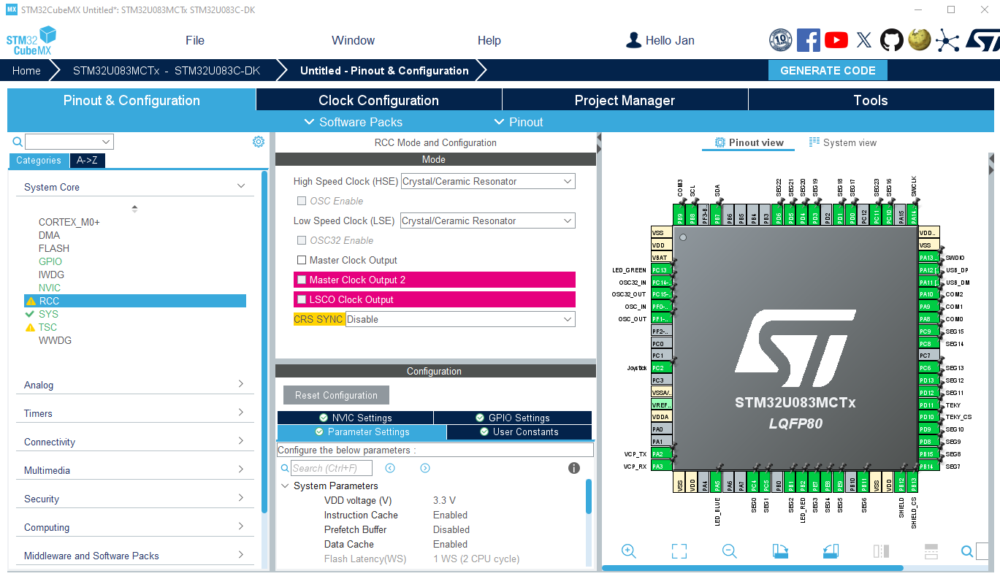
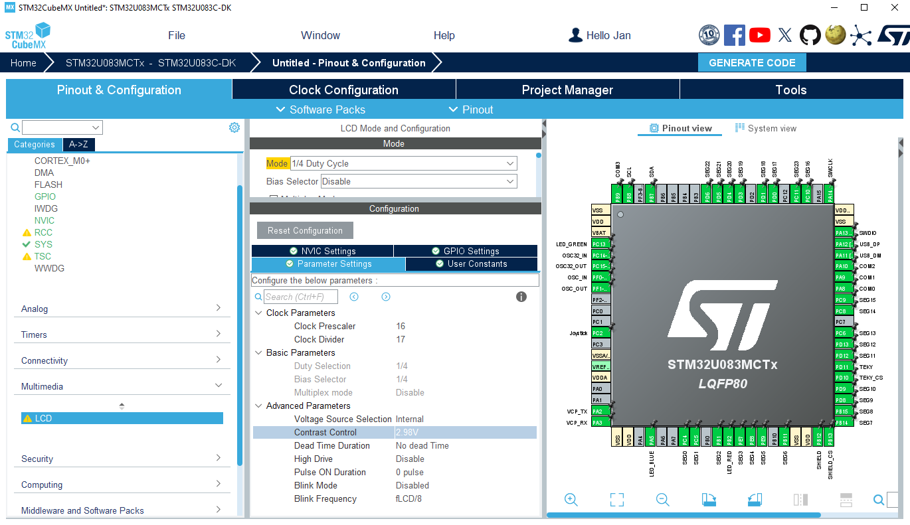
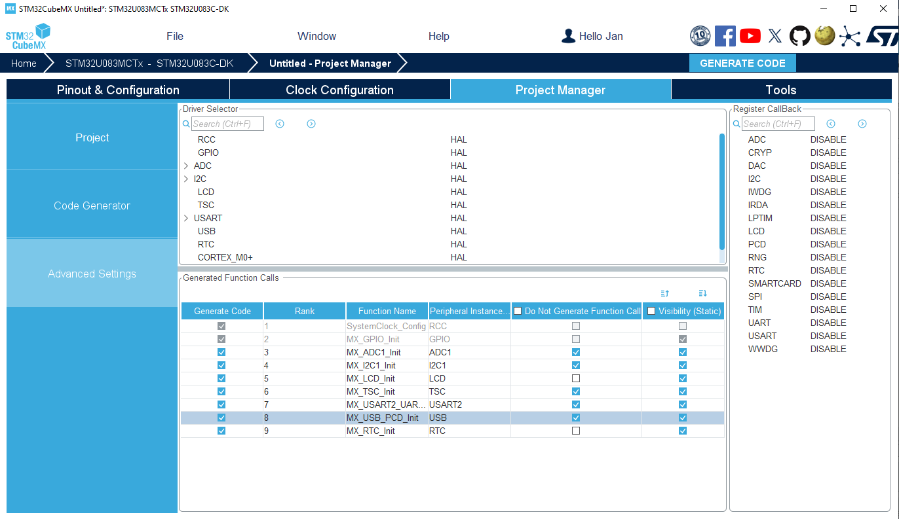

----!
Presentation
----!

# LSE crystal
- Configured Low Speed Clock `Crystal/Ceramic Resonator`
- Already done in default configuration 

# RealTime Clock unit
To clock LCD by external low speed crystal, the LSE must be activated within RTC configuration.

 

Note that **LSESYSEN bit in BDCR** must be enabled as well (missing in RM description), otherwise LSE is not clocked. It's already enabled by default in `HAL_RCC_OscConfig()` function call.

- Select **RTC** instance
  
- Tick `Activate Clock Source`

# Liquid crystal display controller
Few parameters must be configured

- Select `1/4 Duty Cycle` Mode

- Select `1/4 Bias Selector`

- To get Frame rate ~30 Hz for LCD designed 1/4 duty (4 COMs)
  - f_frame = f_lcdclk / (2^PS x (16+DIV)) * duty
  - PS = 4 and DIV = 1
  - f_frame = 32768 / (16 x 17) x 1/4 = 30.12 Hz
  - `Clock Prescaler = 16` and `Clock Divider = 17`
  
- Increase `Contrast control = 2.99V`

- Select following segments SEG**x**: `6, 11, 14, 15, 22, 23, 24, 26, 27, 28, 29, 32, 33, 34, 35, 36, 37, 38, 45, 46, 47, 48, 49`

# Clock Configuration
- Keep **HSI** to `16 MHz` as `System Clock`
  
- Select **LSE** as source for `RTC/LCD`

 

<awarning>
PC3 is not configured as VLCD pin for VLCD generation! Bug found as cannot be configured here in CubeMX. Will be modified in user code.
</awarning>

 

  

# Advanced Settings
- Do not generate Function Call for **ADC1, I2C1, TSC, USART2, USB** as it's not needed for LCD hands on.

# Project Manager
Project is now ready for generation!

- Select **CubeIDE Toolchain**

- Write project name and `Generate Code`
  

  