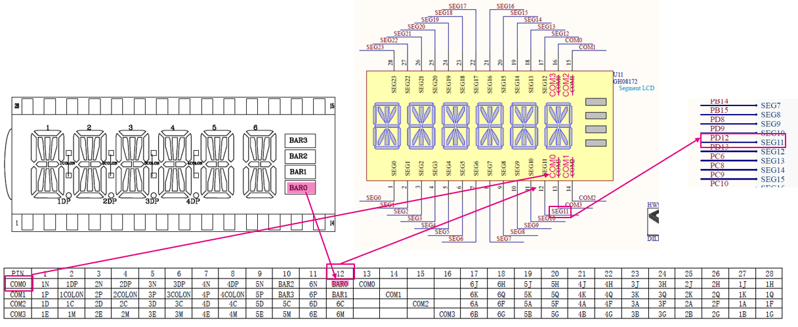
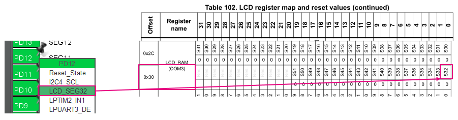

----!
Presentation
----!

# LCD Segment mapping

To activate one segment "BAR0" following SRAM registers must be targeted.

- upper Register COM3 = `LCD_RAM_REGISTER7`
- LCD_SEG_32 = `bit 0`
  
## LCD wiring
Combination LCD DS and STM32U083-DK schematic 

<awarning>
Note, there is typo in current schematic version related to COMs signal and COMs LCD pin.
</awarning>

 

 

- LCD Register description in Reference Manual
  

