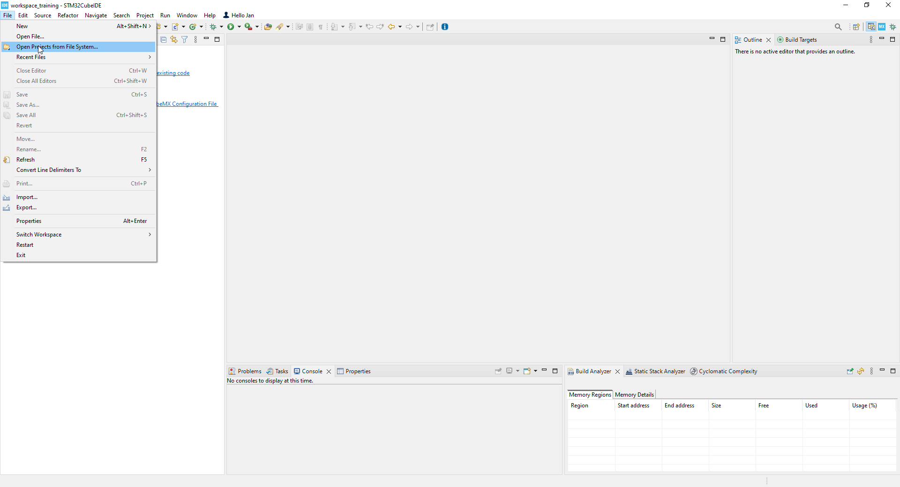

----!
Presentation
----!

# CubeIDE
- Open **CubeIDE** and related `Stop 3` project



# Flash linker script
In hands-on we disable data retention in almost all SRAMs except partial 8kB region in SRAM2. To avoid any HardFault error or random values founded in variables a correct memory allocation must be defined in *linker script STM32U385RGTXQ_FLASH.ld*.

- Define RAM memory region only for `SRAM2`

```c
MEMORY
{
  RAM    (xrw)    : ORIGIN = 0x20030000,   LENGTH = 8K
  FLASH    (rx)    : ORIGIN = 0x08000000,   LENGTH = 1024K
}
```
<p> </p>
**Note** in standard application with wider use of power modes and peripheral you might need to place buffers and DMA handlers in dedicated SRAM2 section by using `attribute` 

e.g. `uint32_t variable __attribute__((section(".sram2")));`

# Initialization

## System Initialization
Enable SMPS as core regulator instead of LDO

Copy paste following snippet in `USER CODE BEGIN SysInit` section in **main.c** file:

```c
/* Enable the SMPS regulator to improve power efficiency */
  if(HAL_PWREx_ConfigSupply(PWR_SMPS_SUPPLY) != HAL_OK)
  {
	  Error_Handler();
  }
```

## Configuration for STOPx mode
Copy paste following snippet in `USER CODE BEGIN 2` section in **main.c** file:

```c
/*Flash in power down mode during Stop mode - by default after reset */
HAL_PWREx_DisableFlashFastWakeUp();

/*Reduce SRAM2 retention in Stop mode to 8 kB*/
HAL_PWREx_DisableRAMsContentStopRetention(PWR_SRAM2_PAGE2_STOP_RETENTION); // reduction -600nA
HAL_PWREx_DisableRAMsContentStopRetention(PWR_SRAM2_PAGE3_STOP_RETENTION);
HAL_PWREx_DisableRAMsContentStopRetention(PWR_FDCAN_USB_STOP_RETENTION);
HAL_PWREx_DisableRAMsContentStopRetention(PWR_PKA_STOP_RETENTION);

/*Put full SRAM1 in power down mode*/
HAL_PWREx_EnableRAMsPowerDown(PWR_SRAM1_POWERDOWN); // reduction - 500nA
```

# Application

Generate PWM signal and enter in Stop 2 mode 

Copy paste following snippet in `USER CODE BEGIN 2` section in **main.c** file:

```c
/* Run PWM signal on PC1 pin*/
HAL_LPTIM_PWM_Start(&hlptim1, LPTIM_CHANNEL_1);

/* Enter STOP 2 mode */
  HAL_PWR_EnterSTOPMode(PWR_LOWPOWERMODE_STOP2, PWR_STOPENTRY_WFI);
```

Now we can measure consumption to check PWM activity PC1 (36 pin of CN7) to PA5 (11 pin of CN10)


Expected consumption ** ~6 uA** when LED is not connected and **~ uA** when LED is connected deu to driving .


