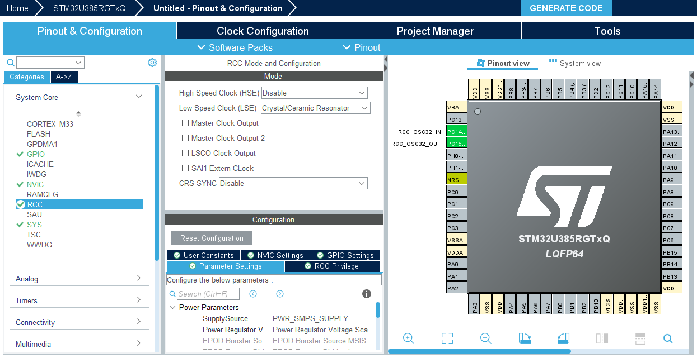
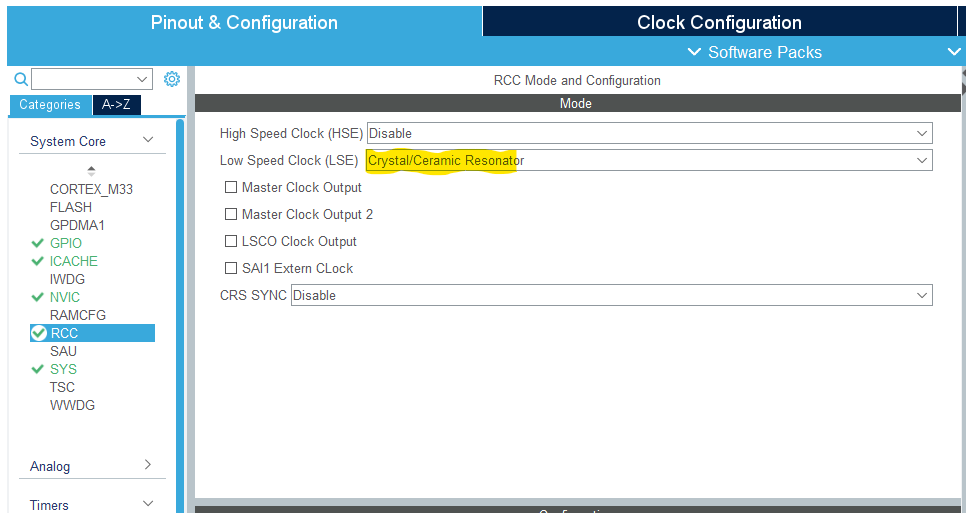
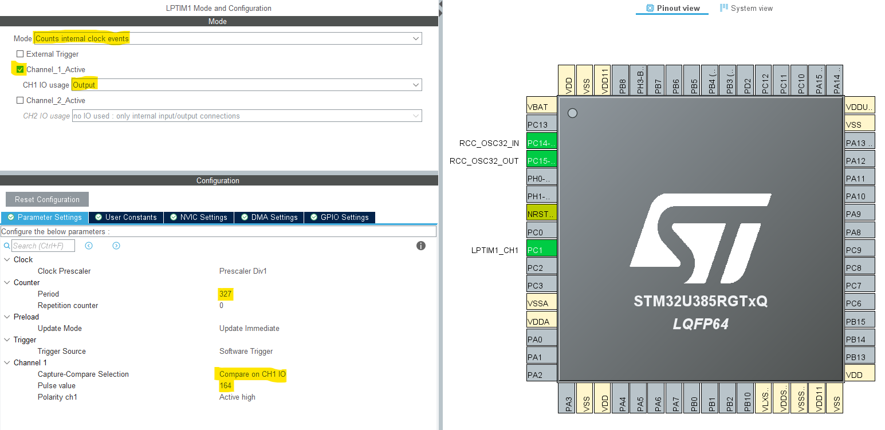
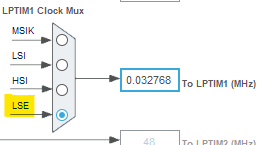
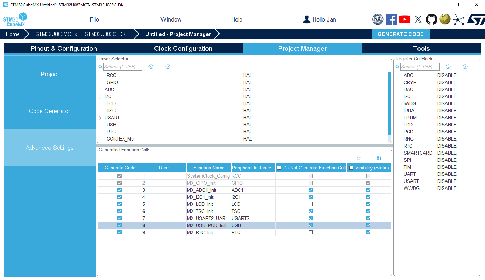
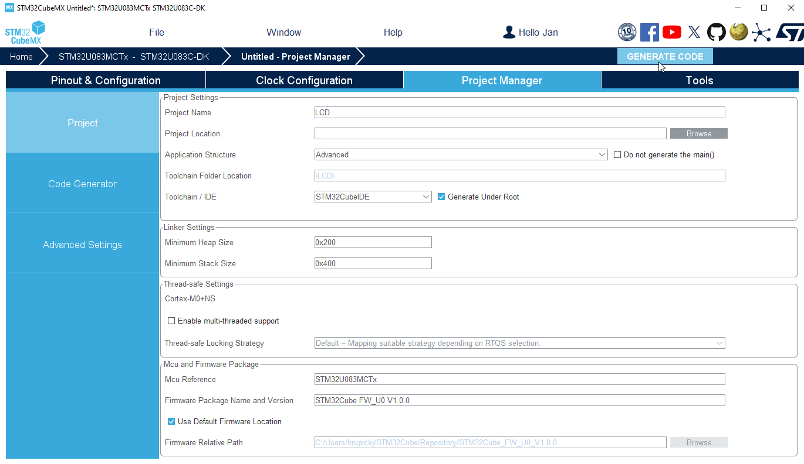

----!
Presentation
----!

# LSE crystal
- Configured Low Speed Clock `Crystal/Ceramic Resonator`
- Already done in default configuration 

# RealTime Clock unit
To clock LCD by external low speed crystal, the LSE must be activated within RTC configuration.

 

- Select **RTC** instance
  
- Tick `Activate Clock Source`

# LPTIM1 unit
- Mode `Counts internal clock events`

- enable `Channel_1_Active` - assigned to PC1 pin
  
- Select CH1 IO usage as `output`

Kernel clock will be selected LSE 32 768 Hz and requested PWM signal is 100 Hz
- period `327`

- Capture Compare Selection `Compare on CH1 IO`
  
- Pulse value `164`
  

# Clock Configuration
- Set **MSIS/MSIK** to `96/2 MHz` as `System Clock`
  
- Select **LSE** as source for `LPTIM1`
    

# Advanced Settings
- Do not generate Function Call for **ADC1, I2C1, TSC, USART2, USB** as it's not needed for LCD hands on.

# Project Manager
Project is now ready for generation!

- Select **CubeIDE Toolchain**

- Write project name and `Generate Code`
  

  