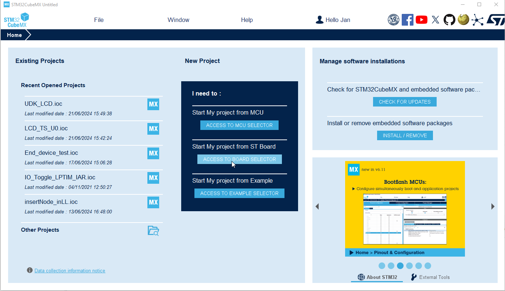
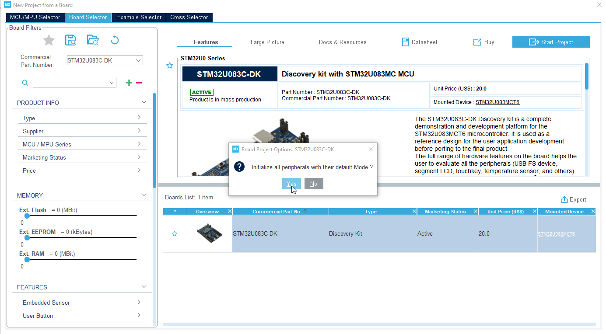

----!
Presentation
----!
# Open CubeMx or CubeMX plugin in CubeIDE

<ainfo> 
To avoid any IO LCD assignment configuration issue. Let open project related to **STM320U83C-DK** board where LCD pins are already assigned.
</ainfo>

 

Press **Access to BOARD SELECTOR**

 

# Select STM320U83C-DK and Start Project

 

# Initialize all peripherals
- click **YES**

 

