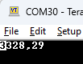

----!
Presentation
----!

# CubeIDE
- Open **CubeIDE** and related `lpuart fifo` project


# Correct minor bugs in Generated Project
## LSE configuration
LSE state is wrongly configured, must be **RCC_LSE_ON** otherwise no kernel clock is provided to LPUART1.

Change LSEState in `SystemClock_Config()` function in **main.c** file:

```c
  RCC_OscInitStruct.LSEState = RCC_LSE_ON; //bug = RCC_LSE_ON_RTC_ONLY
```
<br />

# Initialization

## Variables
Copy paste following snippet in `USER CODE BEGIN EFP` section in **main.h** file:

```c
extern uint8_t bufferRX[8];
```

Copy paste following snippet in `USER CODE BEGIN PV` section in **main.c** file:

```c
uint8_t bufferTX[] = "\n\r Hello";
uint8_t bufferRX[8] = "";
```

## Configuration for STOPx mode
Copy paste following snippet in `USER CODE BEGIN 2` section in **main.c** file:

```c
/* Enable Power Clock */
__HAL_RCC_PWR_CLK_ENABLE();

/*Flash in power down mode */
HAL_PWREx_EnableFlashPowerDown(PWR_FLASHPD_STOP);

/*RTC in Ultra power mode*/
HAL_RTCEx_SetLowPowerCalib(&hrtc, RTC_LPCAL_SET);

/*Keep LPUART clocked in Stop mode*/
HAL_UARTEx_EnableStopMode(&hlpuart1);
```

# STOPx mode
Enter in Stop2 mode by **__WFI()** instruction, verify consumption and periodic wakeup sequence.

Copy paste following snippet in `while(1) loop` section in **main.c** file:

```c
HAL_PWREx_EnterSTOP2Mode(PWR_STOPENTRY_WFI); 
```

## Debug in STOPx mode
In case when debug in LP modes is required. Due to fact bus is clocked the internal SysTick must be suspend - 1 ms interrupt would cause exit from Stop mode.

Copy paste following snippet in `while(1) loop` section in **main.c** file:

```c
HAL_SuspendTick();
/*Enter in STOP2 mode*/
HAL_PWREx_EnterSTOP2Mode(PWR_STOPENTRY_WFI); 
HAL_ResumeTick();
```

# LPUART acitivity in HAL library

## TX in polling mode
Copy paste following snippet in `while(1) loop` before `EnterSTOP2Mode` section in **main.c** file:

```c
/*TX data w/o FIFO
* expected time spend in Run mode ~ 10ms
* */
HAL_UART_Transmit(&hlpuart1, (uint8_t*)bufferTX, 8, 1000);
```
<p> </p>

Now open ComPort Terminal connect to STLink Virtual Comport *(9600 baudrate, 8 bits, no Parity, 1 Stop bit)*

<p> </p>



<p> </p>

## TX in FIFO mode
Delete or comment HAL_UART_Transmit(..) function.

Copy paste following snippet in `while(1) loop` section in **main.c** file:

```c
	  /*TX data w/ FIFO
	   * expected time spend in Run mode <1ms (170us measured by scope)
	   * */
	  uint32_t i = 0;
	  while(__HAL_UART_GET_FLAG(&hlpuart1, UART_FLAG_TXFNF))
	  {
		  LPUART1->TDR = (uint8_t)bufferTX[i];
		  i++;
	  }
```

## RX in FIFO mode

Enable interrupt for RXFIFO threshold.

Copy paste following snippet in `USER CODE BEGIN 2` section in **main.c** file:

```c
/* Enable IT for RXFIFO reaches Threshold = 8 bytes in our case*/
__HAL_UART_ENABLE_IT(&hlpuart1, UART_IT_RXFT);
```
<p> </p>

Delete or comment `HAL_UART_IRQHandler(&hlpuart1)` function in ISR `USART3_LPUART1_IRQHandler(void)` section in **stm32u0xx_it.c** file:

<p> </p>

Copy paste following snippet in `/* USER CODE BEGIN USART3_LPUART1_IRQn 1 */` section in **stm32u0xx_it.c** file:

```c
	uint32_t i = 0;
	if(__HAL_UART_GET_FLAG(&hlpuart1, UART_FLAG_RXFT))
	{
		__HAL_UART_CLEAR_FLAG(&hlpuart1, UART_FLAG_RXFT);

		while(__HAL_UART_GET_FLAG(&hlpuart1, UART_FLAG_RXFNE))
		{
			bufferRX[i] = LPUART1->RDR;
			i++;
		}
	}
```

# LPUART acitivity in Low Layer library
## RX in FIFO mode

Copy & paste LL drivers in project folder  **stm32u0xx_ll_lpuart.c** and **stm32u0xx_ll_lpuart.h**

Copy paste following snippet in `USER CODE BEGIN Includes` section in **main.h** file:

```c
#include "stm32u0xx_ll_lpuart.h"
```
<br />

Enable interrupt for RXFIFO threshold.

Copy paste following snippet in `USER CODE BEGIN 2` section in **main.c** file:

```c
/* Enable IT for RXFIFO reaches Threshold = 8 bytes in our case*/
LL_LPUART_EnableIT_RXFT(LPUART1);
```
<p> </p>

Delete or comment `HAL_UART_IRQHandler(&hlpuart1)` function in ISR `USART3_LPUART1_IRQHandler(void)` section in **stm32u0xx_it.c** file:

<p> </p>

Copy paste following snippet in `/* USER CODE BEGIN USART3_LPUART1_IRQn 1 */` section in **stm32u0xx_it.c** file:

```c
uint32_t i = 0;
	if(LL_LPUART_IsActiveFlag_RXFT(LPUART1))
	{
		while(LL_LPUART_IsActiveFlag_RXNE_RXFNE(LPUART1))
		{
			bufferRX[i] = LL_LPUART_ReceiveData8(LPUART1);
			i++;
		}
	}
```