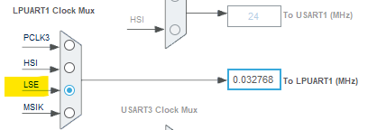

----!
Presentation
----!

# CubeIDE
- Open **CubeIDE** and related `lpuart fifo` project


# Correct minor bugs in Generated Project
## LSE configuration
LSE state is wrongly configured, must be **RCC_LSE_ON** otherwise no kernel clock is provided to LPUART1.

Change LSEState in `SystemClock_Config()` function in **main.c** file:

```c
  RCC_OscInitStruct.LSEState = RCC_LSE_ON; //bug = RCC_LSE_ON_RTC_ONLY
```
<br />

# Initialization

##Includes

Copy paste following snippet in `USER CODE BEGIN Includes` section in **main.c** file:

```c
#include "stm32u3xx_ll_lpuart.h"
#include "stdio.h"
```

## Variables
Copy paste following snippet in `USER CODE BEGIN PV` section in **main.c** file:

```c
char TXbuffer[8];
uint8_t length;
uint8_t i = 0;
```

# STOPx mode
Enter in Stop2 mode by **__WFI()** instruction, verify consumption and periodic wakeup sequence.

Copy paste following snippet in `while(1) loop` section in **main.c** file:

```c
HAL_PWREx_EnterSTOP2Mode(PWR_STOPENTRY_WFI); 
```

## Debug in STOPx mode
In case when debug in LP modes is required. Due to fact bus is clocked the internal SysTick must be suspend - 1 ms interrupt would cause exit from Stop mode.

Copy paste following snippet in `while(1) loop` section in **main.c** file:

```c
HAL_SuspendTick();
/*Enter in STOP2 mode*/
HAL_PWREx_EnterSTOP2Mode(PWR_STOPENTRY_WFI); 
HAL_ResumeTick();
```

# LPUART acitivity in HAL library

## TX in polling mode
Copy paste following snippet in `while(1) loop` before `EnterSTOP3Mode` section in **main.c** file:

```c
/* Convert integers to string with comma and carriage return */
length = sprintf(TXbuffer, "%d,%d\r", Vref, Temp);

/*TX data w/o FIFO
* expected time spend in Run mode ~ 1ms
* */
HAL_UART_Transmit(&hlpuart1, (uint8_t*)TXbuffer, length, 100);
```
<p> </p>

Now open ComPort Terminal connect to STLink Virtual Comport *115200 baudrate, 8 bits, no Parity, 1 Stop bit*

<p> </p>


<p> </p>

## TX in FIFO mode
Return to CubeMX and change few parameter for LPUART1 instance:
- `Baudrate` = 9600​ bits/s
- LPUART1 kernel clock to *LSE*

<p> </p>



<p> </p>
Regenerate code.

Delete or comment HAL_UART_Transmit(..) function.

Open ComPort Terminal connect to STLink Virtual Comport and change *115200 baudrate*, 8 bits, no Parity, 1 Stop bit

Copy paste following snippet in `while(1) loop` section before `EnterSTOP3Mode` in **main.c** file:

```c
/* Enable MCU wake-up by LPUART */
HAL_UARTEx_EnableStopMode(&hlpuart1);
	 
/* Enable IT for Transfer Complete = 8 bytes in our case*/
LL_LPUART_ClearFlag_TC(LPUART1);
LL_LPUART_EnableIT_TC(LPUART1);
	 
/*TX data w/ FIFO */
/* Convert integers to string with comma and carriage return */
length = sprintf(TXbuffer, "%d,%d\r", Vref, Temp);
i = 0;
while(__HAL_UART_GET_FLAG(&hlpuart1, UART_FLAG_TXFNF))
 	 {
 		 LPUART1->TDR = (uint8_t)TXbuffer[i];
 		 i++;
 	 }
HAL_PWR_EnterSTOPMode(PWR_LOWPOWERMODE_STOP2, PWR_STOPENTRY_WFI);
```