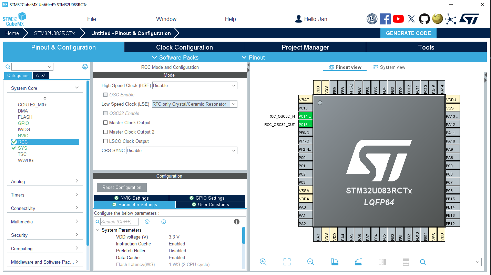
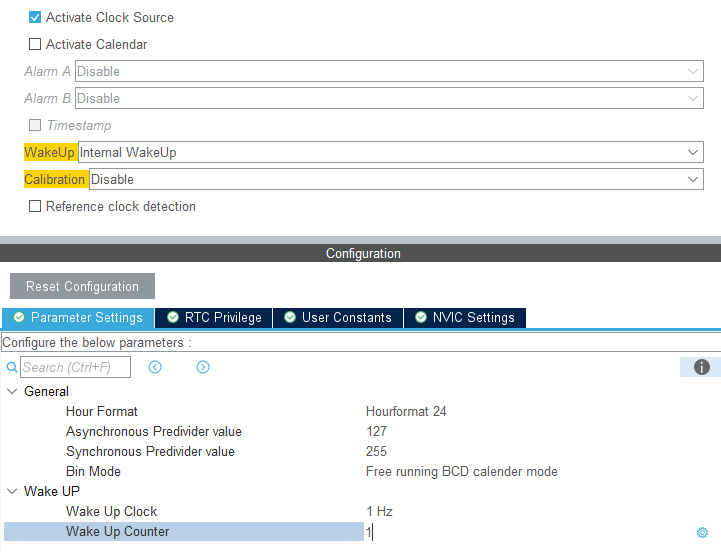
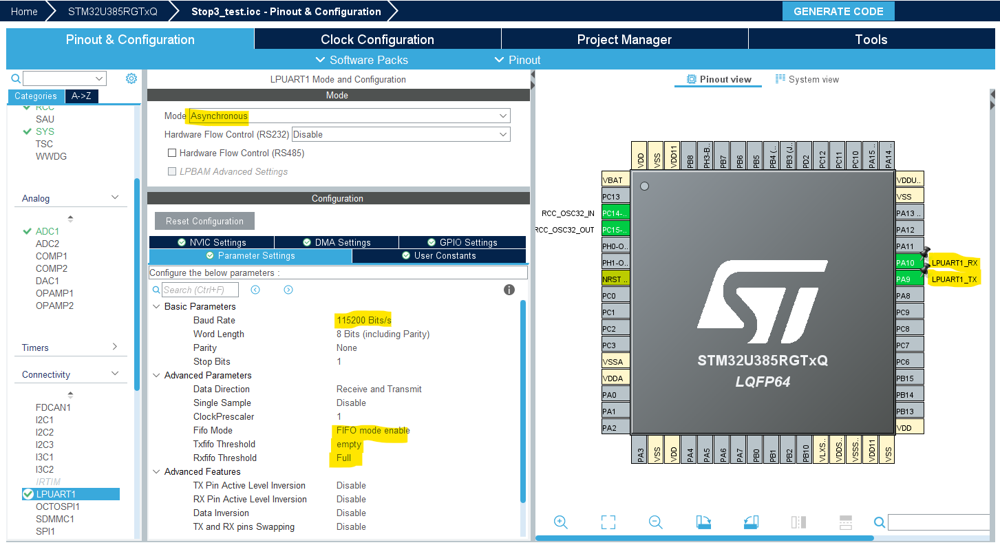
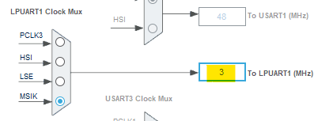

----!
Presentation
----!

# LSE crystal
- Configure Low Speed Clock `Crystal/Ceramic Resonator`

# RealTime Clock unit
To clock RTC and LPUART by external low speed crystal, the LSE must be activated within RTC configuration.

 

- Select **RTC** instance
  
- Tick `Activate Clock Source`

- Select `Internal WakeUp` for WakeUp option
  
- Set `Wake Up clock to 1Hz` base
  
- Set `counter to 1`. Periodic wake up event occurs every 2 seconds

- Enable `RTC and TAMP interrupts` under NVIC tab

# Low Power UART
- LPUART1 is connecetd to STlink via PA9/10 pins and acts as Virtual Comport

- Select **LPUART1** instance
  
- Configure `Asynchronous mode`

- Remap TX/RX to `PA9/10` *(hold CTRL + left mouse click)*

- `Baudrate` = 115200 (or 9600​)

- `Enable FIFO mode`​
  - TxFIFO Th. = Empty​
  - RXFIFO Th. = Full

- Enable `LPUART1 global interrupt` under NVIC tab

# Clock Configuration
- Change **MSIS** to `96/2 MHz` as `System Clock`
  
- Select **LSE** as source for `RTC` 

- Select 3MHz **MSIK/8** as source for `LPUART1`

 

# Project Manager
Project is now ready for generation!

- Select **CubeIDE Toolchain**

- Write project name and `Generate Code`
  
  