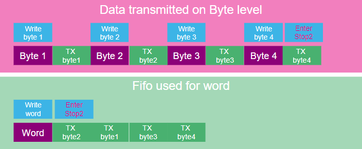

# Use Peripheral's FIFO

- Use FIFO to start TX process and allow do other tasks​
  - USART/LPUART – 8bytes(2words)​
  - SPI - 32bits​
- Use FIFO threshold configuration to be notified when is needed to handle FIFO

Reduce time in Run mode as much as possible

 

 

- Focus on difference when communication is handled in polling mode or by HW with FIFO Tx/Rx buffer
- Configuration of LPUART running down to Stop2 mode
- Exit Stop2 mode thanks to RTC periodical Wakeup timer

## Prerequisites
- Software:
  - **[STM32CubeMX](https://www.st.com/en/development-tools/stm32cubemx.html)** from version 6.11.1
  - **[STM32CubeIDE](https://www.st.com/en/development-tools/stm32cubeide.html)** from version 1.15.1
  - **[STM32U0 Cube library](https://www.st.com/en/embedded-software/stm32cubeu0.html)** from version 1.0
  
- Hardware:
  - **USB-C** cable 
  - **[NUCLEO-U083RC](https://www.st.com/en/evaluation-tools/nucleo-u083rc.html)** board 

- Documentation:
  - STM32U0 **[Reference Manual](https://www.st.com/resource/en/user_manual/um3261-stm32u0-series-safety-manual-stmicroelectronics.pdf)** 
  - STM32U0 **[Data Sheet](https://www.st.com/resource/en/datasheet/stm32u083cc.pdf)**
  - **[Schematic](https://www.st.com/resource/en/schematic_pack/mb1932-u083rc-b01-schematic.pdf)** NUCLEO-U083RC

