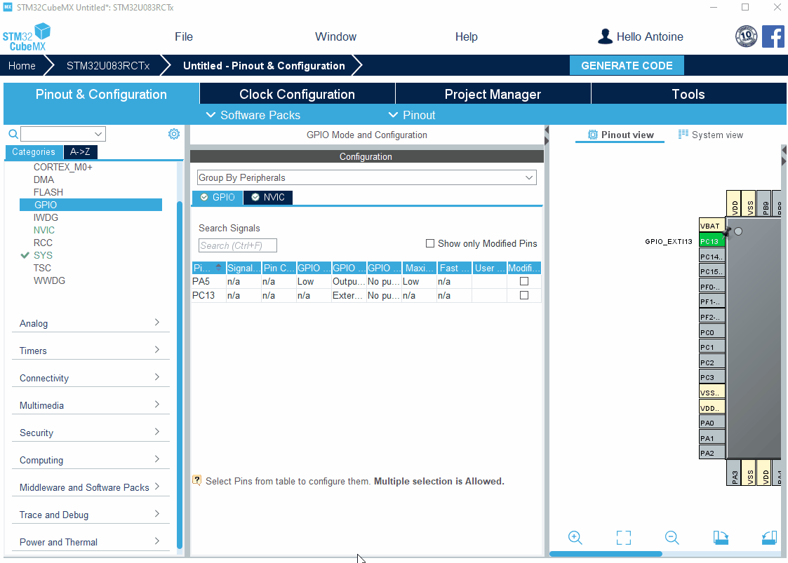

----!
Presentation
----!
# Configuration of the LED GPIO
On this example, **LED4** will be used to monitor pullup retention.
On the NUCLEO-U083RC, LED4 is connected to pin PA5 of the MCU.

- Click on PA5 and set as *GPIO_Output*

In `System view`, go in the `GPIO` section to change the GPIO settings of PA5:

- Verify PA5 is in *Output Push-Pull* mode
- Change default Output to *High* (LED On)

# Configuration of User Button
We will use the **USER Button** of the NUCLEO-U083RC link to the pin PC13 on the MCU side to generate interrupt and enter in Shutdown.

- Click on PC13 and set as *GPIO_EXTI13*
- Go to the GPIO settings

- Set the PC13 pin in `PullUp`
- Change the GPIO mode to `External Interrupt Mode with Falling edge trigger detection`
- in NVIC tab, Activate the Interrupt

# Configuration of RTC

- Go on RTC and check `Activate Clock Source`

All pins needed are configured. Go to `Project Manager` section and **generate** the project.
