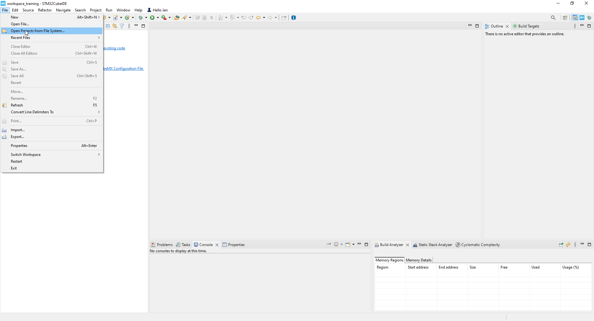
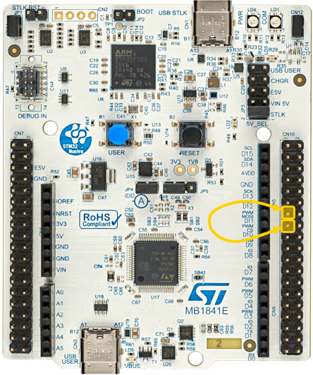
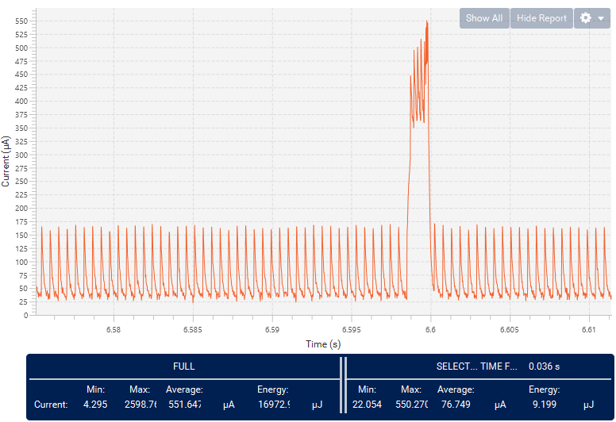

----!
Presentation
----!

# CubeIDE
- Open **CubeIDE** and related `SPI Autonomous mode` project



# Initialization
## Define

Copy paste following snippet in `USER CODE BEGIN PD` section in **main.c** file:

```c
#define BUFFERSIZE	sizeof(aTxBuffer)
```

## Variables
Copy paste following snippet in `USER CODE BEGIN PV` section in **main.c** file:

```c
uint8_t aTxBuffer[] =
		"** SPI Message ******** SPI Message ******** SPI Message ******** SPI Message ******** SPI Message ******** SPI Message";

static uint8_t aRxBuffer[BUFFERSIZE];
```
## System Initialization
Reset backup domain and RTC wakeup timer.

Copy paste following snippet in `USER CODE BEGIN Init` section in **main.c** file:

```c
/*Reset backup domain and RTC wakeup timer*/
  __HAL_RCC_PWR_CLK_ENABLE();
  HAL_PWR_EnableBkUpAccess();
  __HAL_RCC_BACKUPRESET_FORCE();
  while (__HAL_RCC_GET_FLAG(RCC_FLAG_LSERDY))
		;
  __HAL_RCC_BACKUPRESET_RELEASE();
```

Enable SMPS as core regulator instead of LDO. 
And disable clock of all unused peripherals under STOPx mode, reduce consumption due to presence of bus clock.

Copy paste following snippet in `USER CODE BEGIN SysInit` section in **main.c** file:

```c
/* Enable the SMPS regulator to improve power efficiency */
  if(HAL_PWREx_ConfigSupply(PWR_SMPS_SUPPLY) != HAL_OK)
  {
	  Error_Handler();
  }

  /*Clock gating of all unused peripherals under STOPx mode, reduce consumption due to presence of bus clock*/
  __HAL_RCC_GPIOA_CLK_STOP_DISABLE();
  __HAL_RCC_GPIOC_CLK_STOP_DISABLE();
  __HAL_RCC_SRAM2_CLK_STOP_DISABLE();
```

Delete or comment `HAL_RTCEx_SetWakeUpTimer` called in `MX_RTC_Init()`.

```c
  /** Enable the WakeUp
  */
 // not here
```

# Application
Prepare DMA transfers and buffers. Disable all interrupt from DMA to prevent wake up. 
In real application this may differ or keep enabled DMA error flag at least.
SPI communication will be triggered after 2s in STOP1 mode.

Copy paste following snippet in `USER CODE BEGIN 2` section in **main.c** file:

```c
/*Start the Full Duplex Communication process*/
if (HAL_SPI_TransmitReceive_DMA(&hspi1, (uint8_t*) aTxBuffer,(uint8_t*) aRxBuffer, BUFFERSIZE) != HAL_OK) {
  		/* Transfer error in transmission process */
  Error_Handler();
}
  
/*Disable all interrupt to prevent wakeup from STOP mode after DMA transfer*/
__HAL_DMA_DISABLE_IT(&handle_GPDMA1_Channel7, (DMA_IT_TC | DMA_IT_HT | DMA_IT_DTE | DMA_IT_ULE | DMA_IT_USE | DMA_IT_TO));
__HAL_DMA_DISABLE_IT(&handle_GPDMA1_Channel6, (DMA_IT_TC | DMA_IT_HT | DMA_IT_DTE | DMA_IT_ULE | DMA_IT_USE | DMA_IT_TO));

/*for show-case transfer data after 2s in STOP mode*/
if (HAL_RTCEx_SetWakeUpTimer(&hrtc, 1, RTC_WAKEUPCLOCK_CK_SPRE_16BITS) != HAL_OK)
{
  Error_Handler();
}
  
/*SPI in autonomous mode operated down to STOP1 mode*/
HAL_PWR_EnterSTOPMode(PWR_LOWPOWERMODE_STOP1, PWR_STOPENTRY_WFI);
```

# Check functionality

## Buffer received??
Now data are transferred. Verify them by user button push connected to exti line and interrupt wakes up device from STOP1 mode.
Called function in exti callback compare known transmit buffer with received one. If all bytes matches USER LED switches on.

Copy paste following snippet in `USER CODE BEGIN 0` section in **main.c** file:

```c
static uint16_t Buffercmp(uint8_t *pBuffer1, uint8_t *pBuffer2,
		uint16_t BufferLength) {
	while (BufferLength--) {
		if ((*pBuffer1) != *pBuffer2) {
			return BufferLength;
		}
		pBuffer1++;
		pBuffer2++;
	}

	return 0;
}

void HAL_GPIO_EXTI_Rising_Callback(uint16_t GPIO_Pin)
{
	/*Compare the sent and received buffers*/
	if (Buffercmp((uint8_t*) aTxBuffer, (uint8_t*) aRxBuffer, BUFFERSIZE) == 0) {
		/* RX Buffer OK */
		HAL_GPIO_TogglePin(GPIOA, GPIO_PIN_5);
	}
}
```

Do not forget to connect together SPI MOSI and MISO pin CN10 pin 13/15 by available jumper or wire.



##Consumption

Expected consumption under STOP1 mode **~65 uA** when all SRAMs retained. 
During SPI data transfer there is current peaks with average consumption **~400 uA**.


