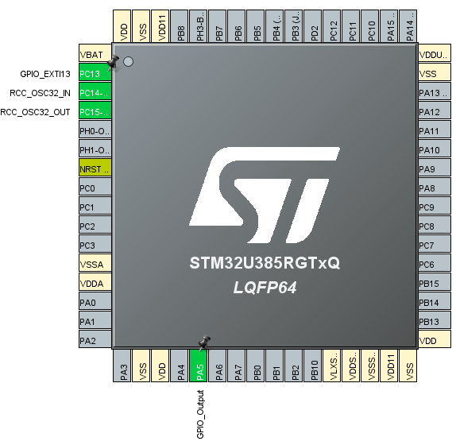
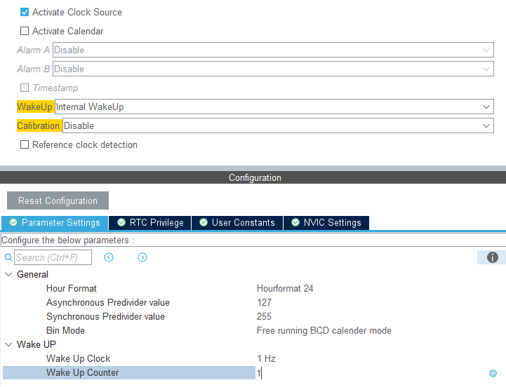
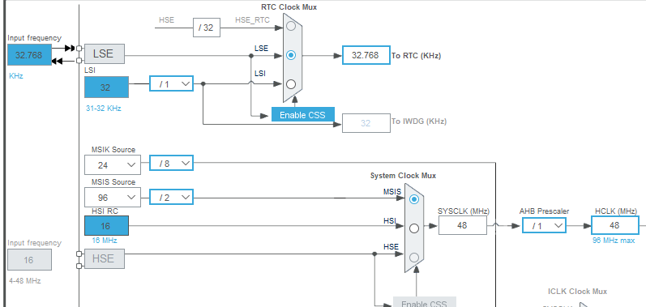
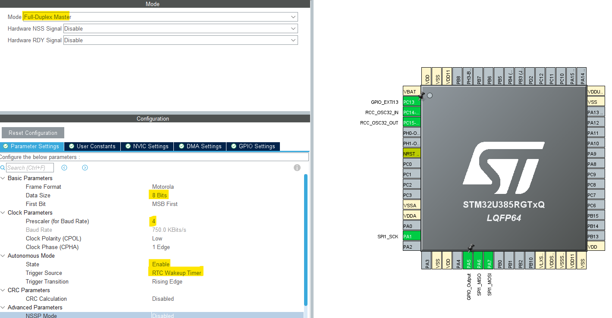
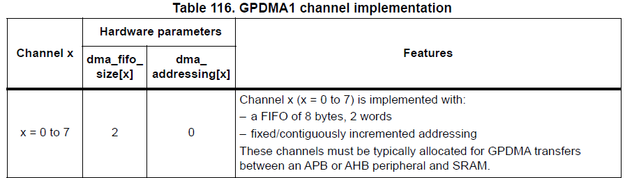
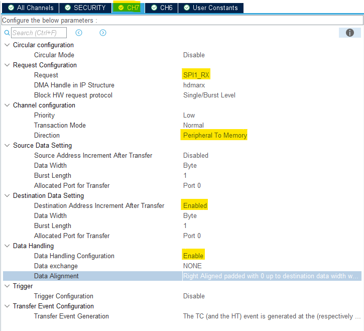
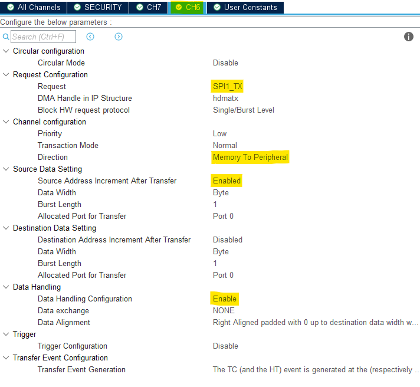

----!
Presentation
----!

# LSE crystal and pinout
- Configure Low Speed Clock `Crystal/Ceramic Resonator`

- Select PC13 as `GPIO_EXTI13` for wake up device from Stop1 mode and validate transferred data.
  - external pull-down on PC13 is not populated, `enable internal pull-down`
  
- For same reason assign `GPIO_Output` to PA5. User LED is connected to this pin.

# RealTime Clock unit
To clock RTC and LPUART by external low speed crystal, the LSE must be activated within RTC configuration.

 

- Select **RTC** instance
  
- Tick `Activate Clock Source`

- Select `Internal WakeUp` for WakeUp option
  
- Set `Wake Up clock to 1Hz` base
  
- Set `counter to 1`. Periodic wake up event occurs every 2 seconds

# Clock Configuration
- Set **MSIS** to `96/2 MHz` as `System Clock`

- Reduce **MSIK** to `24/8 MHz`
  
- Select **MSIK** as source for `SPI1`
  
- Select **LSE** as source for `RTC`
    

# SPI in Autonomous mode
## SPI
- For simplicity we sill use wire and connect SPI MOSI and MISO together which creates loopback.
- SPI is available on CN10 pin 13/15 via PA6/7 pins.

- Select **SPI1** instance
  
- Configure `Full-Duplex Master` mode

- `Data Size` = 8 bits

- `Prescaler` = 4​
  - so the Baudrate = 750 KBit/s

- Enable `Autonomous Mode`
  - `Trigger Source` = RTC Wakeup Timer
  - keep `Rising edge`

 

## GPDMA
- Refer to Reference manual RM0487 table 116. SPIx is part of APB bus. To access them DMA channels must be assigned in range 0-7.

 

- Select **GPDMA1** instance
  
- Configure `channel 7 and 8` to Standard Request Mode

- go to `CH7` tab:
  - `request` SPI1_RX (hdmarx IP structure)
  - `Direction` Peripheral To Memory
  - Enable `Destination Address Increment after Transfer`
  - Enable `Data Handling Configuration` and keep default `Righr Aligned padded with 0...`

 

- go to `CH6` tab:
  - `request` SPI1_TX (hdmatx IP structure)
  - `Direction` Memory to Peripheral
  - Enable `Source Address Increment after Transfer`
  - Enable `Data Handling Configuration` and keep default `Righr Aligned padded with 0...`

 

DMA Interrupt under **NVIC** instance are enabled by default. It can be kept, however in our example it's not used.

# Clock Configuration
- Change **MSIS** to `96/2 MHz` as `System Clock`
  
- Select **LSE** as source for `RTC` 

- Select 3MHz **MSIK/8** as source for `SPI1`

 

# Project Manager
Project is now ready for generation!

- Select **CubeIDE Toolchain**

- Write project name and `Generate Code`
  