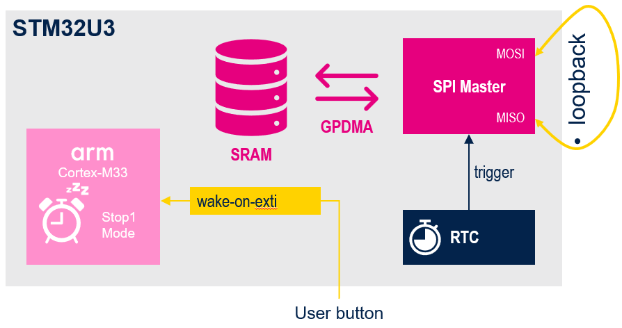

# SPI communication in Autonomous mode

Several peripherals support the autonomous mode which allows it to be functional and
perform DMA transfers in Stop 0, Stop 1, and Stop 2 modes. Their interrupts wake up fromStop mode.

- Configuration of SPI1 Master Full-Duplex in Autonomous mode running down to Stop1 mode
- Data are transferred to MISO by simple loopback and verify after exit of STOP1 by user LED
- Exit Stop1 mode thanks to User button connected to exti13 line

 

## Prerequisites
- Software:
  - **[STM32CubeMX](https://www.st.com/en/development-tools/stm32cubemx.html)** from version 6.14
  - **[STM32CubeIDE](https://www.st.com/en/development-tools/stm32cubeide.html)** from version 1.17
  - **[STM32U3 Cube library](https://www.st.com/en/embedded-software/stm32cubeu3.html)** from version 1.1
  
- Hardware:
  - 2x **USB-C** cable 
  - **[NUCLEO-U385RG](https://www.st.com/en/evaluation-tools/nucleo-u385rg-q.html)** board 
  - A-meter or **[STLink-V3PWR](https://www.st.com/en/development-tools/stlink-v3pwr.html)**

- Documentation:
  - STM32U3 **[Reference Manual](https://www.st.com/resource/en/reference_manual/rm0487-stm32u3-series-armbased-32bit-mcus-stmicroelectronics.pdf)** 
  - STM32U3 **[Data Sheet](https://www.st.com/resource/en/datasheet/stm32u385rg.pdf)**
  - **[Schematic](https://www.st.com/resource/en/schematic_pack/mb1841-u385rgq-e01-schematic.pdf)** NUCLEO-U385RG
