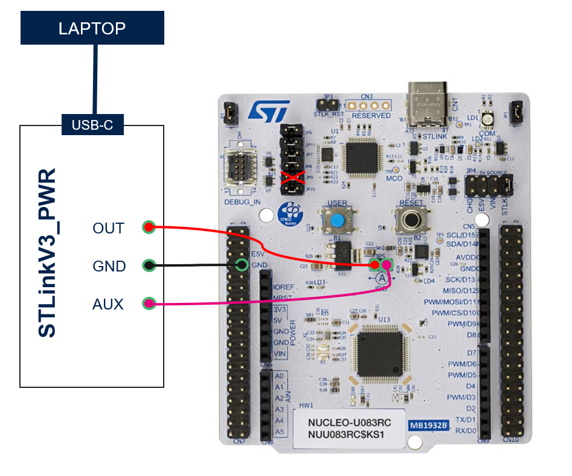
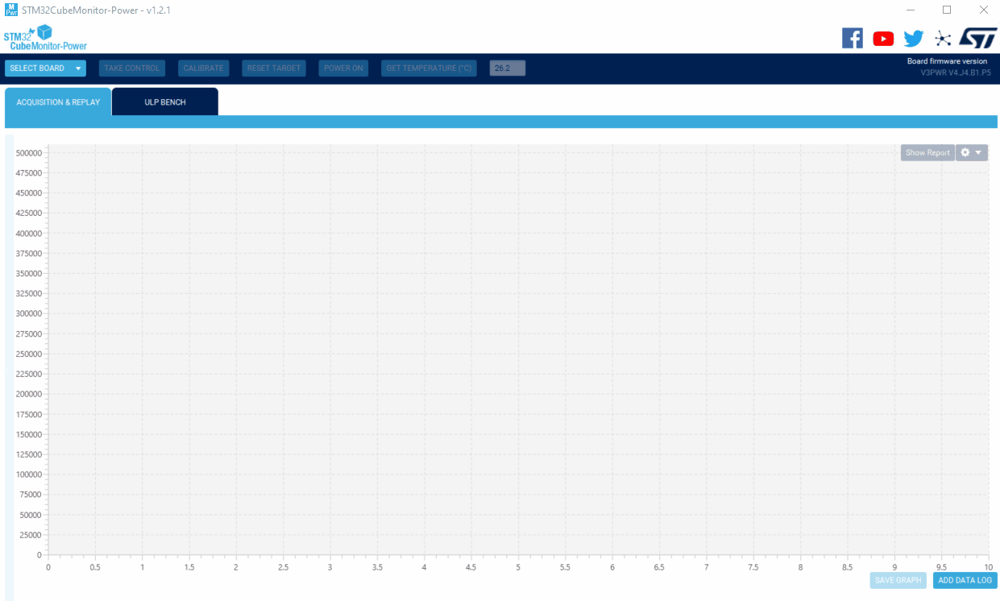
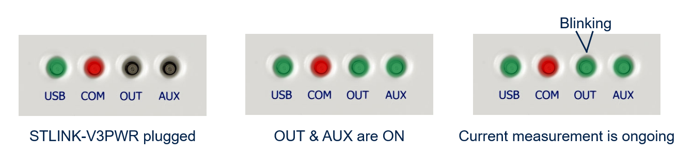
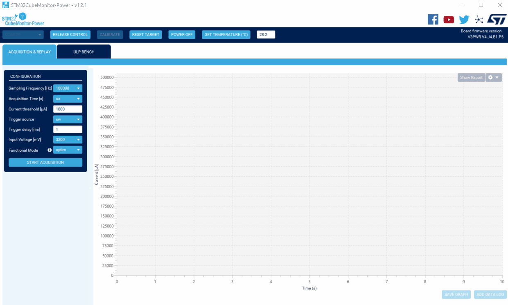

----!
Presentation
----!
# Connect the STLINK-V3PWR to the NUCLEO board
To be able to supply the application with the **STLINK-V3PWR** and measure its consumption, we need to do the following modifications on the NUCLEO-U083RC:

- Remove the jumper *JP9*. It will cut the NRST signal between the internal STLink of the NUCLEO and the MCU to avoid overconsumption
- Remove the jumper *JP5*. It will cut the link between the NUCLEO 3V3 and the MCU VDD

Now, we need to connect the **STLINK-V3PWR** as explain just below:

- STLINK-V3PWR **OUT** <---> **VDD MCU** (left pin of JP5)
- STLINK-V3PWR **GND** <---> **GND MCU**
- STLINK-V3PWR **AUX** <---> **3V3 NUCLEO** (right pin of JP5)

# STLINK-V3PWR controlled by STM32CubeMonPWR
To control the **STLINK-V3PWR**, we will use **STM32CubeMonPWR**.
When it is open, select the STLINK-v3PWR COM Port avec click on `TAKE CONTROL`.

You can also refer to the **STLINK-V3PWR** LEDs to monitor its state.

# STLINK-V3PWR Configuration
In the left panel we can choose different parameters like:

- The Sampling frequency
- The acquisition time
- the Input voltage

When the configuration is done, we can power the full application by clicking on `POWER ON`.

# Measure Consumption
To measure the real time consumption of the application, we need to click on `START ACQUISITION`.
After stopping the acquisition, we can select a more precise window and display the average consumption using the `Show Report` button:

