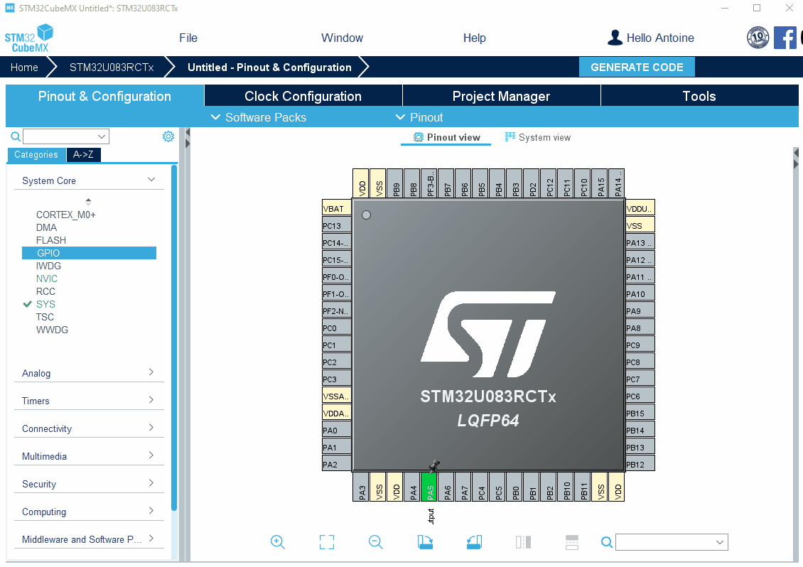
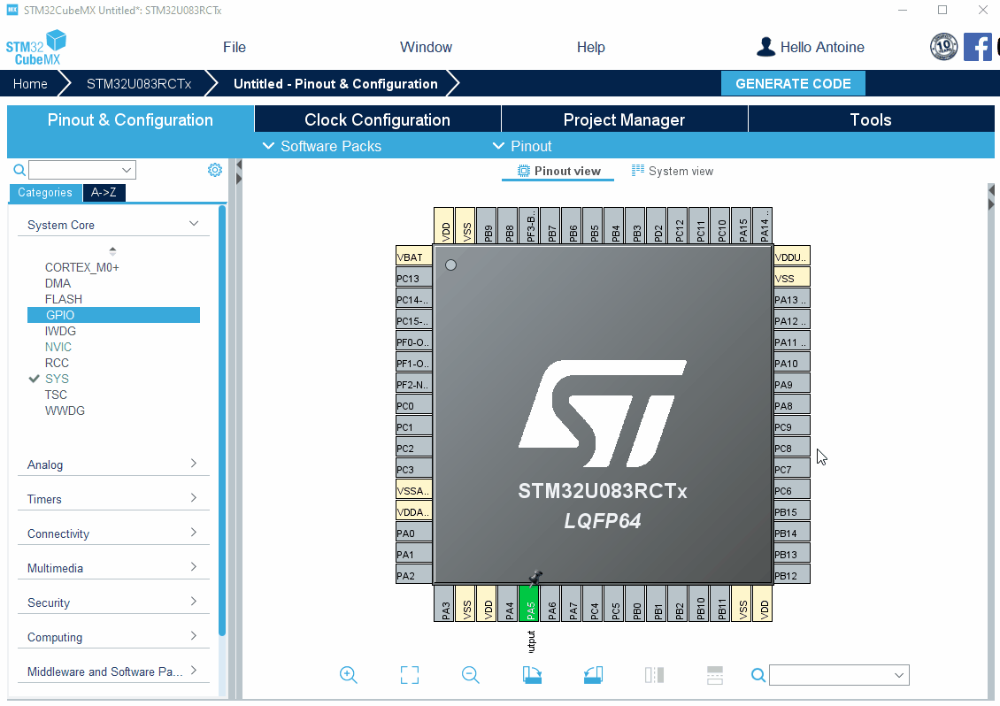

----!
Presentation
----!
# Configuration of the LED GPIO
On this example, **LED4** will be used to monitor pullup retention.
On the NUCLEO-U083RC, LED4 is connected to pin PA5 of the MCU.

- Click on PA5 and set as *GPIO_Output*

In `System view`, go in the `GPIO` section to change the GPIO settings of PA5:

- Verify PA5 is in *Output Push-Pull* mode
- Change default Output to *High* (LED On)

# Configuration of the WakeUp pin
To wake up the system from Standby, we will use the **USER Button** of the NUCLEO-U083RC link to the pin PC13 on the MCU side.

- Click on PC13 and set as *PWR_WKUP2*

# Project generation
All pins needed are configured. Go to `Project Manager` section to generate the project:

- Select **STM32CubeIDE** toolchain/IDE
- Write project name and click on `GENERATE CODE`

