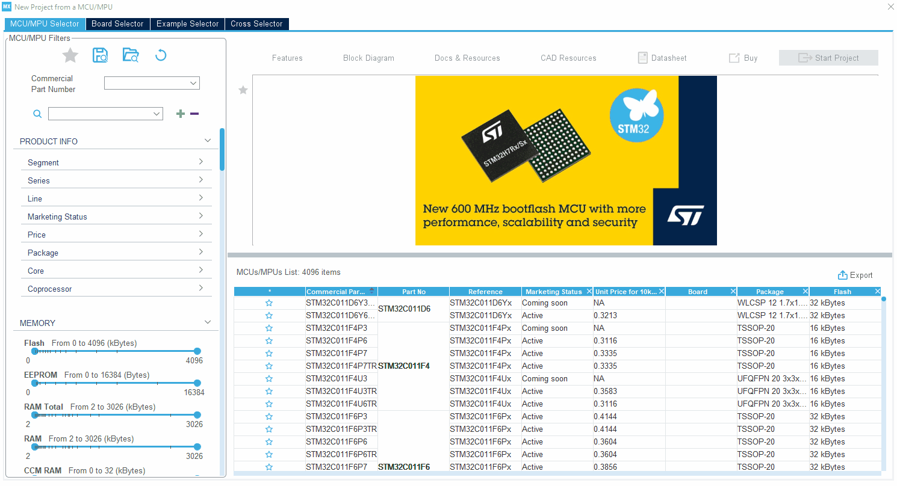

----!
Presentation
----!
# Create a new project with CubeMX
In CubeMX, start a new project by selecting `ACCESS TO MCU SELECTION`.

# Select the MCU to use for this hands on
In this example, we will use the STM32U083RCT6 embedded on the NUCLEO-U083RC board.

- Select the **STM32U083RCT6** and then click on `Start Project`.

