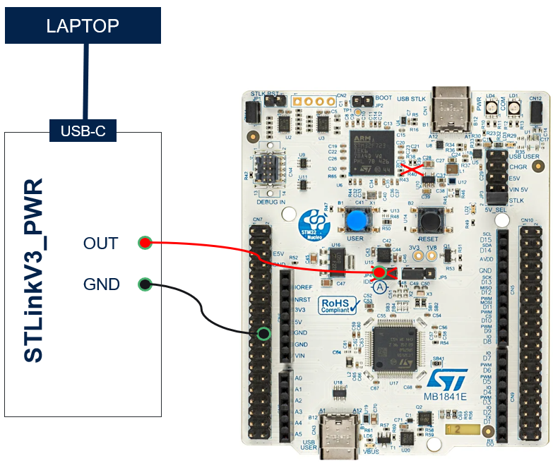

----!
Presentation
----!

# CubeIDE
- Open **CubeIDE** and related `Stop 3` project


# Flash linker script
In hands-on we disable data retention in almost all SRAMs except partial 8kB region in SRAM2. To avoid any HardFault error or random values founded in variables a correct memory allocation must be defined in *linker script STM32U385RGTXQ_FLASH.ld*.

- Define RAM memory region only for `SRAM2`

```c
MEMORY
{
  RAM    (xrw)    : ORIGIN = 0x20030000,   LENGTH = 8K
  FLASH    (rx)    : ORIGIN = 0x08000000,   LENGTH = 1024K
}
```
<p> </p>
**Note** in standard application with wider use of power modes and peripheral you might need to place buffers and DMA handlers in dedicated SRAM2 section by using `attribute` 

e.g. `uint32_t variable __attribute__((section(".sram2")));`


# Initialization

## System Initialization
Enable SMPS as core regulator instead of LDO

Copy paste following snippet in `USER CODE BEGIN SysInit` section in **main.c** file:

```c
/* Enable the SMPS regulator to improve power efficiency */
  if(HAL_PWREx_ConfigSupply(PWR_SMPS_SUPPLY) != HAL_OK)
  {
	  Error_Handler();
  }
```

## Configuration for STOPx mode
Copy paste following snippet in `USER CODE BEGIN 2` section in **main.c** file:

```c
/*Flash in power down mode during Stop mode - by default after reset */
HAL_PWREx_DisableFlashFastWakeUp();

/*Reduce SRAM2 retention in Stop mode to 8 kB*/
HAL_PWREx_DisableRAMsContentStopRetention(PWR_SRAM2_PAGE2_STOP_RETENTION); // reduction -600nA
HAL_PWREx_DisableRAMsContentStopRetention(PWR_SRAM2_PAGE3_STOP_RETENTION);
HAL_PWREx_DisableRAMsContentStopRetention(PWR_FDCAN_USB_STOP_RETENTION);
HAL_PWREx_DisableRAMsContentStopRetention(PWR_PKA_STOP_RETENTION);

/*Put full SRAM1 in power down mode*/
HAL_PWREx_EnableRAMsPowerDown(PWR_SRAM1_POWERDOWN); // reduction - 500nA

/* Configure RTC wake up source for STop3 mode - RM Table 78. PWR wake-up source selection IN*/
HAL_PWR_EnableWakeUpLine(PWR_WAKEUP_LINE7, PWR_WAKEUP_SELECT_3, PWR_WAKEUP_POLARITY_HIGH);
```

# STOPx mode
Enter in Stop3 mode by **__WFI()** instruction, clear all pending flags verify consumption and periodic wakeup sequence. Perform power on reset if target consumption is not achieved.

Copy paste following snippet in `while(1) loop` section in **main.c** file:

```c
/*Clear all wakeup source flags*/
__HAL_PWR_CLEAR_FLAG(PWR_WAKEUP_ALL_FLAG);

/* Enter STOP 3 mode */
HAL_PWR_EnterSTOPMode(PWR_LOWPOWERMODE_STOP3, PWR_STOPENTRY_WFI);
```
<p> </p>

## Debug in STOPx mode
In case when debug in LP modes is required. Due to fact bus is clocked the internal SysTick must be suspend - 1 ms interrupt would cause exit from Stop mode.

Copy paste following snippet in `while(1) loop` section in **main.c** file:

```c
HAL_SuspendTick();
/*Clear all wakeup source flags*/
__HAL_PWR_CLEAR_FLAG(PWR_WAKEUP_ALL_FLAG);

/* Enter STOP 3 mode */
HAL_PWR_EnterSTOPMode(PWR_LOWPOWERMODE_STOP3, PWR_STOPENTRY_WFI);
HAL_ResumeTick();
```

- now project can be compiled and load in to device

# Current consumption profile

- tatic consumption can be measured by A-meter on JP4 for dynamic profile it's better use **STLink-V3PWR**
- to avoid any leakage and measure correct values with STLink-V3PWR:
  - remove R40 (connection Slink IO and nRST line of mcu)
  - supply VDD_MCU domain **(left pin of JP4)**
  - unplug USB-C of STlink
- consumption profile is visualized in **[Cube Monitor PWR](https://www.st.com/en/development-tools/stm32cubemonpwr.html)**
  
Expected consumption **~2.5 uA**. Visible peaks are due to technology and requires for regulator refresh.

<p> </p>


